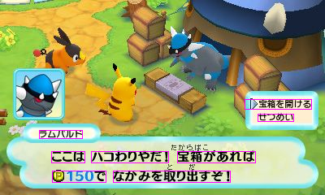
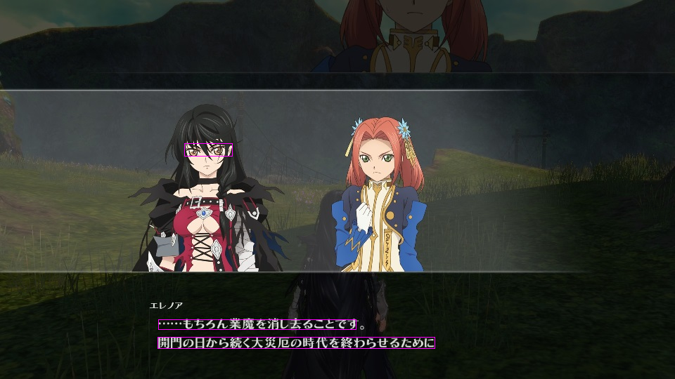
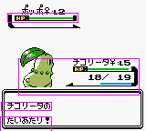

# Text Position Detector
Detects rectangular regions containing multilingual text in an image.

This project is based on Michael R. Lyu, Jiqiang Song and Min Cai's
"A comprehensive method for multilingual video text detection, localization,
and extraction". The extraction part is left out.

The default configuration works best for horizontally-aligned,
well contrasted sinograms.

## Usage

Run `TextPositionDetector.apply` to get a list of rectangles where text was
detected.

## Examples

Different parameters give different results depending on the characteristics
of the input image. Here on inputs taken from video games:

 - Good result:

 - Minor mishaps:

- Bad result:

